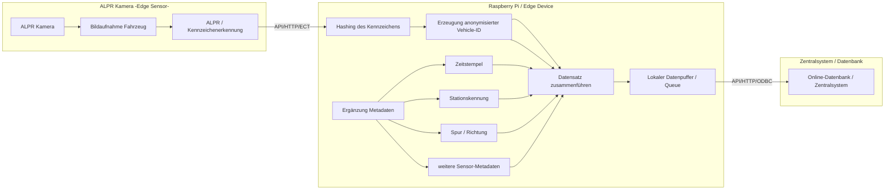
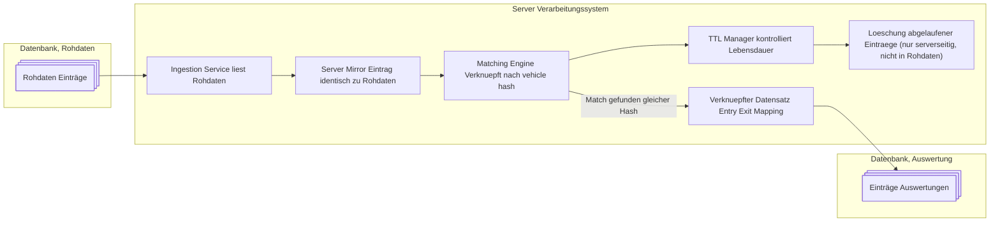

# Konzept: Anonymisierte Verkehrsfluss- und Reisezeitanalyse mittels Edge-Hashing (ANPR)

## 1. Ausgangslage

In einer Ortschaft wird der überwiegende Verkehrsfluss (ca. 95%) über  grosse Einfallstrassen abgewickelt. Ziel ist es, diese Verkehrsströme zeitabhängig zu erfassen und daraus Reisezeiten sowie Bewegungsmuster innerhalb des Stadtgebiets abzuleiten.

Das System ist skalierbar auf bis zu 20 Fahrspuren und kann auch auf grössere Knotennetze erweitert werden.

---

## 2. Zielsetzung

Das System verfolgt drei Hauptziele:

- Punktuelle Erfassung von Verkehrsströmen an definierten Ein- und Ausfahrtsachsen
- Bestimmung von Reisezeiten zwischen Einfahrts- und Ausfahrtspunkten
- Statistische Erkennung von Durchgangsverkehr vs. innerstädtischem Zielverkehr

---

## 3. Systemübersicht

Das System basiert auf ANPR-Kameras (Automatic Number Plate Recognition), die an allen relevanten Fahrspuren installiert sind.

Grundprinzip:

- Fahrzeug passiert Kamera A (Einfahrt)
- Kennzeichen wird lokal erkannt und sofort gehasht (Edge Processing)
- Hash + Zeitstempel werden gespeichert
- Fahrzeug passiert Kamera B (Ausfahrt)
- gleicher Hash wird erneut erkannt
- zentraler Batch-Prozess vergleicht Ereignisse

---

## 4. Datenschutzkonzept (DSG-konform)

Das System ist vollständig auf Datenschutz ausgelegt:

- Keine Speicherung von Klartext-Kennzeichen
- Hash-Erstellung erfolgt direkt auf der Kamera (Edge Device)
- Hash ist:
  - stabil (gleiches Fahrzeug → gleicher Hash)
  - nicht rückrechenbar (one-way hashing)
- Keine zentrale Identitätsauflösung möglich
- Daten gelten als anonymisierte Bewegungsereignisse

---

## 5. Datenmodell

Jedes Ereignis besteht aus:

VehicleEvent:
- vehicle_hash
- timestamp
- location_id (Kamera / Spur)
- direction (in/out)

---

## 6. Matching-Logik

Die zentrale Verarbeitung erfolgt im Batch-Modus.

Grundlogik:

- Einfahrt: (hash, t_in, location_in)
- Ausfahrt: (hash, t_out, location_out)

Reisezeit:

travel_time = t_out - t_in

---

## 7. Umgang mit fehlenden Daten

Fehlende Datensätze werden aus den Auswertungen ausgeschlossen bzw. gelöscht.

Die Einsatzdauer des Systems muss grundsätzlich lange genug sein, um Informationen zu Fahrzeugen von Anwohnern erfassen zu können. Generell empfiehlt sich eine Einsatzdauer von 2 Wochen.

Erfasste Nummernschilder von in der Ortschaft ansässigen Fahrzeugen sollten generell über die Erfassungszeit mehrfach erfasst werden.
Dadurch können diese Datensätze ausgewertet werden.

Hashes welche nach Abschluss der Erfassung nur einmalig erfasst wurden, können nicht mit einer Zweiterfassung abgeschlossen werden, und werden dadurch nach Beendigung gelöscht. 

Interessant für die statistischen Auswertungen sind nur die terminierten Meldungen, welche jeweils zweimal erfasst wurden.

Für die Vermeidung von zuvielen Fehlerkennungen, wird nach Aufbau der Messstationen erst um Mitternacht produktiv mit der Erfassung begonnen. Da ist der Verkehrsfluss meist minimal und die Anzahl der Anstösser kann einfacher erfasst werden.

---

## 8. Durchgangsverkehrs-Erkennung

Durchgangsverkehr wird über vollständige Match-Paare definiert:

Entry detected + Exit detected → Transit Vehicle

Innerstädtischer Verkehr wird indirekt bestimmt durch:

- fehlende Ausfahrtserkennung
- stark abweichende Reisezeiten
- Aufenthaltsdauer über definierte Schwellenwerte

---

## 9. Reisezeit-Analyse

Die Reisezeit wird zeitabhängig ausgewertet:

- Tageszeitabhängige Mittelwerte
- Wochentagsprofile
- Peak vs. Off-Peak Analyse

Abweichungen werden genutzt zur:

- Stauanalyse
- Ereigniserkennung
- Infrastrukturplanung

---

## 10. Skalierung auf komplexe Netze

Das System soll erweiterbar sein auf:

- bis zu 20 Fahrspuren im Basisdesign
- beliebig viele Knotenpunkte

Die einzigen notwendigen Skalierungen für die Erweiterungen sind folgende Elemente:
- Datendurchsatz für Datenbankverbindungen (kann durch Bulk optimiert werden)
- Verarbeitungsleistung Server
- Später bei grafischer Ausgabe, Aufbereitungsgeschwindigkeit

---

## 11. Statistikmodell

Zur Abschätzung des innerstädtischen Verkehrs wird ein probabilistisches Modell verwendet:

- Anteil Transitverkehr wird direkt gemessen
- Rest wird als Mischung aus:
  - Zielverkehr
  - lokalen Fahrten
  - unvollständigen Messungen

Optional:

- Statistische Schätzung für Aufenthaltswahrscheinlichkeit
- Zeitfenster-basierte Clusterung

---

## 12. Systemarchitektur

Edge Layer (Kameras)
- ANPR-Erkennung
- Hashing direkt auf Edge
- Zeitstempelung

Ingestion Layer
- Event-Streaming (Batch-Buffer)

Central Processing
- Matching Engine
- Statistik-Engine
- Zeitreihenanalyse

---

## 13. Vorteile des Systems

- Vollständig DSG-konform
- Keine personenbezogenen Daten im Backend
- Hohe Skalierbarkeit
- Robust gegenüber Datenverlusten
- Erweiterbar für Batch- und spätere Echtzeitanalyse

---

## 14. Erweiterungsmöglichkeiten

- Predictive Traffic Modeling (ML)
- Echtzeit-Stauwarnsystem
- Simulation von Verkehrsveränderungen
- Heatmaps
- automatische geo-lokalisierung durch GPS
- Erfassung der Fahrzeugkategorie (MIV) und Weitergabe mit Hash
- graphbasierte Modellierung des Straßennetzes
- Multi-Hop-Matching (A → B → C → D)

## 15. Möglichkeiten für Hardwareintegration

Folgender Hardware-Stack könnte für Prototypen oder produktive Versionen eingesetzt werden:

- AXIS P1465-LE-3 (ALPR, distance 7-20m, height 3-10m, bis 105km/h) für automatische Erfassung der Kennzeichen, ohne Klassierung
- LiFePo4 Akkupack, 600Ah
- Raspberry Pi 5 für Hashing der Nummern, Upload der Hashes mit Zeitstempel
- Für Prototyp, Advantech-Router für Internetverbindung zu Datenbank, Alternativ Raspberry Pi Hat, Modul mit 4G/5G
- Einstellung des Stationsnamen direkt im Gehäuse über bspw. Codierscheiben oder minimales GUI über Display. Möglichst einfache Konfiguration.
- Einstellung der Erfassungsgruppe im Gehäuse, um die Erfassung mit gleicher Hardware an unterschiedlichen Standorten / Ortschaften zu ermöglichen. 

### 15.1 Leistungsverbrauch und Autonomiezeit
|Verbraucher        |Leistungsaufnahme|
|-------------------|-----------------|
|Kamera 2x          | 7.2W            |
|Raspberry Pi 5     | 6W              |
|Advantech ICR 4161W| 6.8W            |
|**Total AVG**      | 27.2W           |

Mit 600Ah kann eine rein rechnerische Laufzeit von 260h oder **11 Tagen** erreicht werden.
Durch Hardware-Optimierungen sollten problemlos bis zu 15 Tage möglich sein.

## 16. Datendiagramm Erfassung

## 17. Datenfluss Verarbeitung

