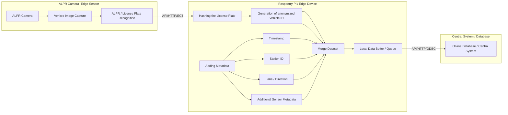
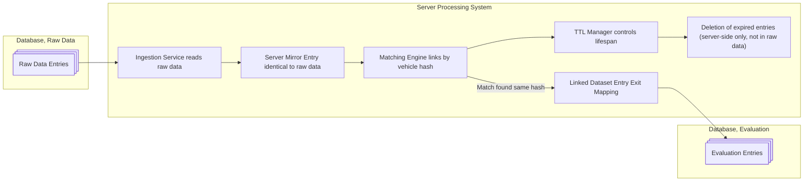

# Concept: Anonymized Traffic Flow and Travel Time Analysis using Edge-Hashing (ANPR)

## 1. Background

In a municipality, the predominant traffic flow (approx. 95%) is handled via major arterial roads. The goal is to capture these traffic flows in a time-dependent manner and derive travel times as well as movement patterns within the urban area.

The system is scalable to up to 20 lanes and can also be extended to larger network nodes.

---

## 2. Objectives

The system pursues three main goals:

- Point-based capture of traffic flows at defined entry and exit axes
- Determination of travel times between entry and exit points
- Statistical detection of transit traffic vs. intra-urban destination traffic

---

## 3. System Overview

The system is based on ANPR cameras (Automatic Number Plate Recognition) installed at all relevant lanes.

Basic principle:

- Vehicle passes Camera A (entry)
- License plate is recognized locally and immediately hashed (Edge Processing)
- Hash + timestamp are stored
- Vehicle passes Camera B (exit)
- Same hash is recognized again
- Central batch process compares events

---

## 4. Data Protection Concept (FADP-compliant)

The system is fully designed for data protection:

- No storage of plain-text license plates
- Hash creation occurs directly on the camera (Edge Device)
- Hash is:
  - stable (same vehicle → same hash)
  - non-reversible (one-way hashing)
- No central identity resolution possible
- Data is considered anonymized movement events

---

## 5. Data Model

Each event consists of:

VehicleEvent:
- vehicle_hash
- timestamp
- location_id (camera / lane)
- direction (in/out)

---

## 6. Matching Logic

Central processing occurs in batch mode.

Basic logic:

- Entry: (hash, t_in, location_in)
- Exit: (hash, t_out, location_out)

Travel time:

travel_time = t_out - t_in

---

## 7. Handling Missing Data

Missing records are excluded from evaluations or deleted.

The operational duration of the system must fundamentally be long enough to capture information about vehicles belonging to local residents. In general, an operational duration of 2 weeks is recommended.

Captured license plates of vehicles registered in the municipality should generally be recorded multiple times over the capture period.
This allows these records to be evaluated.

Hashes that have only been captured once after the completion of the capture period cannot be completed with a second capture, and are therefore deleted upon termination.

Only terminated records that have been captured twice are of interest for statistical evaluations.

To avoid too many false detections, productive capturing only begins at midnight after the measurement stations have been set up. Traffic flow is usually minimal at that time and the number of local residents can be more easily captured.

---

## 8. Transit Traffic Detection

Transit traffic is defined via complete match pairs:

Entry detected + Exit detected → Transit Vehicle

Intra-urban traffic is determined indirectly through:

- missing exit detection
- significantly deviating travel times
- dwell time exceeding defined thresholds

---

## 9. Travel Time Analysis

Travel time is evaluated in a time-dependent manner:

- Time-of-day dependent averages
- Weekday profiles
- Peak vs. Off-Peak analysis

Deviations are used for:

- Congestion analysis
- Event detection
- Infrastructure planning

---

## 10. Scaling to Complex Networks

The system shall be expandable to:

- up to 20 lanes in the base design
- any number of network nodes

The only necessary scaling elements for extensions are:
- Data throughput for database connections (can be optimized through bulk operations)
- Server processing capacity
- Later, for graphical output: rendering speed

---

## 11. Statistical Model

A probabilistic model is used to estimate intra-urban traffic:

- Share of transit traffic is measured directly
- Remainder is treated as a mix of:
  - Destination traffic
  - Local trips
  - Incomplete measurements

Optional:

- Statistical estimation of dwell probability
- Time window-based clustering

---

## 12. System Architecture

Edge Layer (Cameras)
- ANPR detection
- Hashing directly on edge
- Timestamping

Ingestion Layer
- Event streaming (batch buffer)

Central Processing
- Matching Engine
- Statistics Engine
- Time series analysis

---

## 13. System Advantages

- Fully FADP-compliant
- No personal data in the backend
- High scalability
- Robust against data losses
- Expandable for batch and future real-time analysis

---

## 14. Extension Possibilities

- Predictive Traffic Modeling (ML)
- Real-time congestion warning system
- Simulation of traffic changes
- Heatmaps
- Automatic geo-localization via GPS
- Capture of vehicle category (MIV) and transmission with hash
- Graph-based modeling of the road network
- Multi-hop matching (A → B → C → D)

## 15. Hardware Integration Options

The following hardware stack could be used for prototypes or production versions:

- AXIS P1465-LE-3 (ALPR, distance 7-20m, height 3-10m, up to 105km/h) for automatic license plate capture without classification
- LiFePo4 battery pack, 600Ah
- Raspberry Pi 5 for hashing license plate numbers, uploading hashes with timestamp
- For prototype: Advantech router for internet connection to database; alternatively Raspberry Pi Hat module with 4G/5G
- Configuration of the stations name directly in the case, possibly with rotary switches or a minimal GUI on a display. Most important is the easy configuration.
- Configuration of the data-capture group directly in the case, to enable data capturing in different locations / cities at the same time.

### 15.1 Power Consumption and Autonomy Time
|Consumer            |Power Consumption|
|--------------------|-----------------|
|Camera 2x           | 7.2W            |
|Raspberry Pi 5      | 6W              |
|Advantech ICR 4161W | 6.8W            |
|**Total AVG**       | 27.2W           |

With 600Ah, a theoretical runtime of 260 hours or **11 days** can be achieved.
With hardware optimisations it should be easily possible to reach runtimes of up to 15 days.

## 16. Data Capture Diagram

## 17. Data Processing Flow

